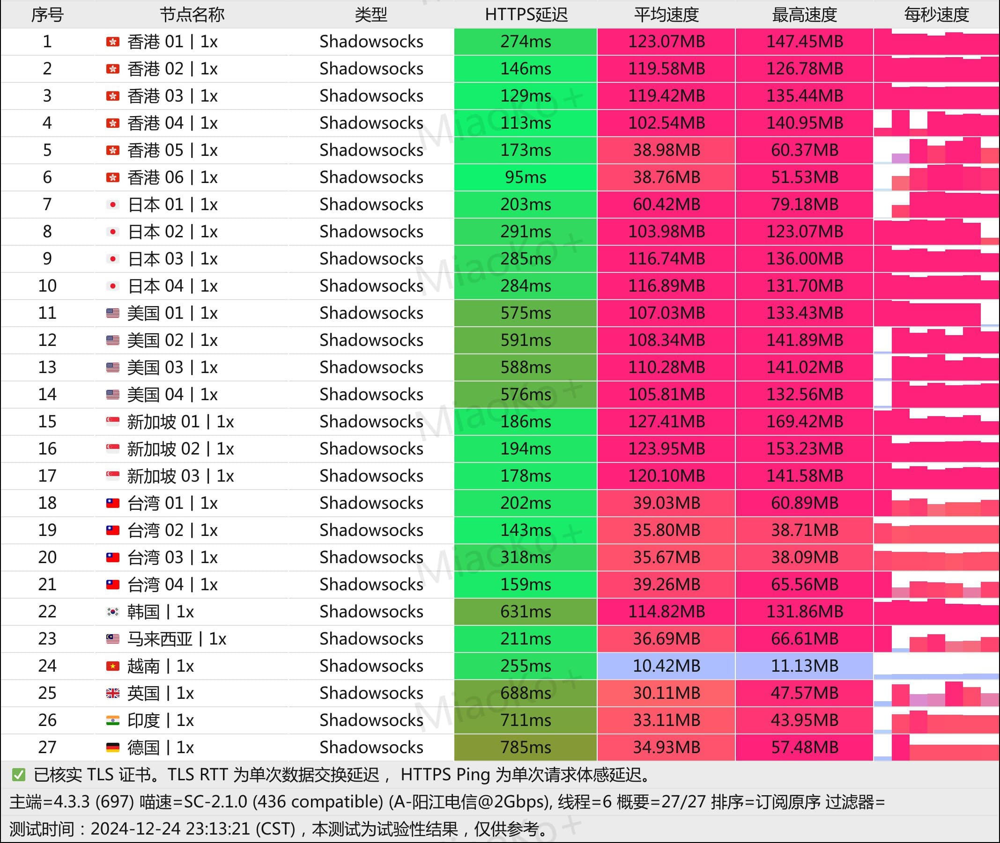
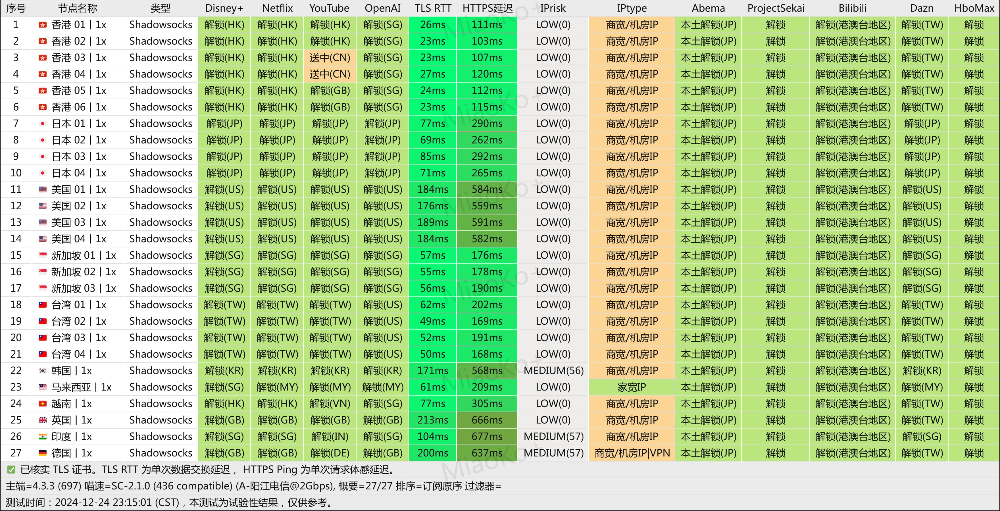
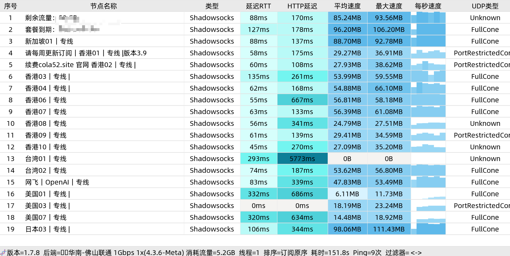

🌍 *[English](README-EN.md) ∙ [简体中文](README.md)*

[国内可访问版本，内容与本页面一致，有需要的可以收藏到书签里](https://help.wwkejishe.top/wang-shang-xue-ke)

[小火箭共享账号每日更新](https://ios.wwkejishe.top/)

更新日期：**2025年8月10日**

## 活动通知

1. TG群：[wwkjs888](https://t.me/wwkjs888)（进群置顶消息，一年免费订阅链接，4000G流量/每月）

## 目录导航

点击文章右上角的三条横杠查看

## 前言声明

> 此教程为了是让大家学习，切勿做违法犯罪的事哦！

TG群：[wwkjs888](https://t.me/wwkjs888)（进群不定期更新免费订阅节点，求稳还是请看 [付费机场](#付费机场推荐)）

- [Skinny 手机卡](https://fk.wangdu.site/buy/13)（[常见问题指南](https://www.wangdu.site/fuliyouhui/2019.html)）：0月租稳定使用的新西兰手机卡，可用来注册 **脸书、推特、Telegram、Gmail、Tiktok、ChatGPT**（国内现货，价格优惠，先到先得）

- [2025年电信移动联通官方大流量卡推荐, 不限速，超低价，快递包邮](https://www.wangdu.site/fuliyouhui/2112.html)

- [dongyubin/IPTV](https://github.com/dongyubin/IPTV): 2025年7月更新📺IPTV电视直播源、APTV电视直播源、IPTV直播软件、超全中国+台港澳+海外IPTV直播源M3U、TV观看工具，iptv最新可用直播源iptv4/iptv6

## 友情赞助

## 🔥推荐Ti子服务器

- [Just My Socks 免搭建，直接使用富强服务👍](JustMySocks.md)（[国内可访问版本，有需要的可以收藏到书签里](https://help.wwkejishe.top/justmysocks)）
- [2025年国外高性价比便宜 VPS 推荐(稳定、好用、免费体验)](https://bestvps.wwkejishe.top/tutorial-vps/choose-vps)：可自行 [Google搭建Ti子](https://home.wwkejishe.top/search/racknerd%E6%90%AD%E5%BB%BA%E6%A2%AF%E5%AD%90)
- [2025年VPS推荐 （自用、稳定、靠谱、便宜有性价比）](https://www.wangdu.site/bestvps)（[RackNerd](https://www.wangdu.site/fuliyouhui/1266.html)、[CloudCone](https://www.wangdu.site/fuliyouhui/2115.html)、[EthernetServers](https://www.wangdu.site/fuliyouhui/2116.html)、[DMIT](https://www.wangdu.site/?golink=aHR0cHM6Ly93d3cuZG1pdC5pby9hZmYucGhwP2FmZj03OTUy) 多家VPS价格动态对比表格）

  
Just My Socks 懒人版（只需2步，轻松富强上网，点我展开）

1. [点击购买 洛杉矶CN2 GIA（高性价比👍）](https://justmysocks3.net/members/aff.php?aff=31458&pid=2&language=chinese)（享受 5.2% 永久优惠，优惠码：`JMS9272283`）
2. [Just My Socks](https://justmysocks3.net/members/aff.php?aff=31458&language=chinese) 自家的专用客户端：[Jamjams](https://justmysocks3.net/members/knowledgebase.php?action=displayarticle&id=5&language=chinese)（支持系统：Windows、MacOS、iOS）

## Shadowsocks软件介绍

**SS**，全称为 **Shadowsocks**（下文简称为`SS`），是一种基于 Socks5 代理方式的网络数据加密传输包的工具，可以使用其于**科学上网** _也就是翻墙_ ，是目前最稳定，最常用的科学上网工具之一，**全平台支持**

**SSR**，全称为 **ShadowsocksR**（下文简称为`SSR`）
来历：

> ShadowsocksR是breakwa11发起的Shadowsocks分支，在Shadowsocks的基础上增加了一些数据混淆方式，称修复了部分安全问题并可以提高QoS优先级。后来贡献者Librehat也为Shadowsocks补上了一些此类特性，甚至增加了类似Tor的可插拔传输层功能。
>
> ShadowsocksR开始时曾有过违反GPL、发放二进制时不发放源码的争议，不过后来ShadowsocksR项目由breakwa11转为了与Shadowsocks相同的GPL、Apache许可证、MIT许可证等多重自由软件许可协议。
>
> 2017年7月19日，ShadowsocksR作者breakwa11在Telegram频道ShadowsocksR news里转发了深圳市启用SS协议检测并被大量用户转发，引发恐慌。7月24日，breakwa11发布了闭源的SS被动检测程序，引发争议。 2017年7月27日，breakwa11遭到自称 “ESU.TV” 的不明身份人士人身攻击，对方宣称如果不停止开发并阻止用户讨论此事件将发布更多包含个人隐私的资料，随后breakwa11表示遭到对方人肉搜索并公开个人资料的是无关人士，为了防止对方继续伤害无关人士，breakwa11将删除GitHub上的所有代码、解散相关交流群组，停止ShadowsocksR项目。但项目已被多人fork。并有人在其基础上继续发布新的版本，例如SSRR
>
> **引用于维基百科**

### 使用教程（以SS为例，SSR差不多）

1.  （**具体信息**的订阅地址）右击**小飞机**，打开**服务器-编辑服务器**，输入服务器信息即可。
2.  （**图片二维码**的订阅地址）右击**小飞机**，打开**服务器-扫描屏幕上的二维码**，服务器信息自动导入。
3.  （**长链接**的订阅地址）右击**小飞机**，打开**服务器-从剪切板导入URL**，服务器信息自动导入。

### Shadowsocks 节点获取

机场请看下面的免费机场、[付费机场](#付费机场推荐)（机场里就是节点）

## 小火箭+机场教程（稳定）👍

机场请看下面的免费机场、[付费机场](#付费机场推荐)（机场里就是节点）

### 免费机场如何转为小火箭（shadowrocket）节点

出于安全考虑，能自己的搭建最好自己搭建。

1. Docker部署镜像：[subconverter](https://github.com/tindy2013/subconverter/releases)（服务端）、[sub-web](https://github.com/CareyWang/sub-web)（网页端）

2. 在线订阅转换链接

   - [https://sub-web.netlify.app/](https://sub-web.netlify.app/)（sub-web作者搭建的）

   

### 小火箭添加订阅链接

## Android手机APP推荐👍

### Panda（APP）

免费用户只能固定线路，有两条推荐线路，看广告可以使用1小时

免费的看视频没问题，资金雄厚的可以300多购买2年的优惠

如果用着好用，请填写我的邀请码：**28712435**，让我为你的奖励发光发热

### 猴王（APP）

免费的，速度也挺快的，就一个底部的广告

### WhaleBlue（APP）

免费的有很多线路，选择最快的起飞?️就行

### 老王（APP）

免费的线路不少，可以智能连接，看一段广告就可以使用VIP加速了。

### 客户端+机场（稳定）

1. 在 [客户端](#windowsmacosandroidios客户端)（也可在下面下载地址获取高速下载链接） 下载适配适配 Android手机的客户端（推荐：Clash、Surfboard、shadowsocks-android）
2. 在下面机场选择对应的节点导入即可

## Android手机APP下载地址

公众号：文武科技社

回复关键词：`网上学科`

## Windows、MacOS、Android、iOS客户端

[客户端使用教程](#客户端使用教程) 需要搭配 [机场](#付费机场推荐) 使用

|                          客户端名称                          |                           支持系统                           | 最后更新时间 |
| :----------------------------------------------------------: | :----------------------------------------------------------: | :----------: |
|   [Pandora-Box](https://github.com/snakem982/Pandora-Box)    |                    Windows、MacOS、Linux                     |     2025     |
| [mihomo-party](https://github.com/mihomo-party-org/mihomo-party) |                    Windows、MacOS、Linux                     |     2025     |
| [karing](https://github.com/KaringX/karing)：兼容 Clash、V2ray/V2fly、Sing-box、Shadowsocks、Sub、Github 订阅（[使用教程](https://karing.app/quickstart)） | [Win](https://github.com/KaringX/karing/releases/latest)、[Mac](https://apps.apple.com/us/app/karing/id6472431552)、[Android](https://github.com/KaringX/karing/releases/latest)、[iOS](https://apps.apple.com/us/app/karing/id6472431552) |     2025     |
|       [sing-box](https://github.com/SagerNet/sing-box)       | [MacOS、iOS](https://sing-box.sagernet.org/zh/clients/apple/)（需要美区账号：[Apple Store注册外国Apple ID教程](https://www.wangdu.site/course/705.html)）、[Android](https://sing-box.sagernet.org/zh/clients/android/) |     2025     |
| [Hiddify](https://github.com/hiddify/hiddify-next)（[官网地址](https://hiddify.com/)）：全面的协议支持：Vless、Vmess、Reality、TUIC、Wireguard、Hysteria、SSH；多种订阅链接和配置文件格式支持： Sing-box、V2ray、Clash、Clash meta |             Windows、MacOS、Linux、Android、iOS              |     2025     |
|                                                              |                             其他                             |              |
|    [OneClick](https://github.com/oneclickearth/oneclick)     |                          安卓、iOS                           |     2022     |
| [Clash👍🏻](https://apkpure.com/cn/clash-for-android/com.github.kr328.clash/versions) |                             安卓                             |     2022     |
| [ClashMetaForAndroid](https://github.com/MetaCubeX/ClashMetaForAndroid/releases) |                           Android                            |     2024     |
|        [Surfboard](https://manual.getsurfboard.com/)         |                           Android                            |     2023     |
| [Wrap+](https://1.1.1.1/)：Cloudflare 公司开发的，[教程：Warp+ 24PB 无限流量密钥](#cloudflare-warp客户端使用教程) |               Windows、MacOS、Linux、安卓、iOS               |     2023     |

### iOS系统

|                          客户端名称                          |             支持系统             | 最后更新时间 |
| :----------------------------------------------------------: | :------------------------------: | :----------: |
| [Shadowrocket（小火箭）在线安装](https://shadowsockshelp.github.io/ios/)、[App Store](https://apps.apple.com/us/app/shadowrocket/id932747118)：收费（$2.99)，美区（[点击购买小火箭永久账号](https://fk.wangdu.site/buy/6)）👍 |          iOS、Apple TV           |     2025     |
| [Quantumult X on the App Store](https://apps.apple.com/us/app/quantumult-x/id1443988620?platform=iphone)：收费（$7.99），美区（[点击购买Quantumult X永久账号](https://fk.wangdu.site/buy/11)） |       MacOS、iOS、Apple TV       |     2025     |
| [Loon on the App Store](https://apps.apple.com/us/app/loon/id1373567447?platform=iphone)：收费（$5.99），美区 |          iOS、Apple TV           |     2024     |
| [Stash on the App Store](https://apps.apple.com/us/app/stash-rule-based-proxy/id1596063349?platform=iphone)：收费（$3.99），美区 |          iOS、Apple TV           |     2024     |
| [Choc on the App Store](https://apps.apple.com/us/app/choc/id1582542227)：收费（$2.99），美区 |               iOS                |     2022     |
|     [Surge](https://nssurge.com/)：收费（$49.99），美区      |            MacOS、iOS            |     2024     |
|    [OneClick](https://github.com/oneclickearth/oneclick)     |            安卓、iOS             |     2022     |
| [Wrap+](https://1.1.1.1/)：Cloudflare 公司开发的，[教程：Warp+ 24PB 无限流量密钥](#cloudflare-warp客户端使用教程) | Windows、MacOS、Linux、安卓、iOS |     2023     |

### Clash系列

Clash 是一款开源的跨平台代理工具，主要用于帮助用户科学上网。它支持多种代理协议，包括 Shadowsocks、V2Ray、Trojan 等，用户可以根据自己的需求选择合适的协议进行配置。同时支持 Windows、macOS、Linux、Android 和 iOS 等多种操作系统。本站收集网络最新各平台 Clash 下载的客户端。

|                          客户端名称                          |            支持系统            | 最后更新时间 |
| :----------------------------------------------------------: | :----------------------------: | :----------: |
|       [FlyClash](https://github.com/GtxFury/FlyClash)        |            Windows             |     2025     |
| [clash-verge新版👍🏻](https://github.com/clash-verge-rev/clash-verge-rev)（[新版下载地址](https://clash-verge-rev.github.io/install.html)） |     Windows、MacOS、Linux      |     2025     |
| [clash-nyanpasu](https://github.com/LibNyanpasu/clash-nyanpasu) |     Windows、MacOS、Linux      |     2025     |
| [GUI.for.Clash](https://github.com/GUI-for-Cores/GUI.for.Clash)（[安装指南](https://gui-for-cores.github.io/zh/guide/01-install)） |     Windows、MacOS、Linux      |     2025     |
|       [FlClash](https://github.com/chen08209/FlClash)        | Windows、MacOS、Linux、Android |     2025     |
| [Clash Mi](https://clashmi.app/download)（[使用教程](https://clashmi.app/guide/)） |   iOS、MacOS、Android、Linux   |     2025     |
| [mihomo-party](https://github.com/pompurin404/mihomo-party?tab=readme-ov-file) |     Windows、MacOS、Linux      |     2024     |
| [ClashX Pro👍🏻](https://install.appcenter.ms/users/clashx/apps/clashx-pro/distribution_groups/public) |             MacOS              |     2023     |
| [Clash](https://github.com/Fndroid/clash_for_windows_pkg)(已删库：20231103)、[Clash汉化包](https://github.com/BoyceLig/Clash_Chinese_Patch/releases)、[备份版本：0.20.39](https://app.nloli.xyz/static/Clash.for.Windows.Setup.0.20.39.exe)、[备份](https://archive.org/details/clash_for_windows_pkg)、[clash for windows 中文汉化备份](https://github.com/clash-hub/clash_for_windows_chinese/releases)、[clash_for_windows_pkg](https://github.com/lantongxue/clash_for_windows_pkg/releases) |            Windows             |     2022     |
| [clash-verge](https://github.com/zzzgydi/clash-verge)（clash暂时替代品【老版已停更】）、 |     Windows、MacOS、Linux      |     2023     |
|          [clashN](https://github.com/2dust/clashN)           |              Win               |     2023     |
| [Fclash](https://github.com/Fclash/Fclash)（20231102只读，没有Release安装包） |    Windows、MacOS、Android     |     2023     |
| [Clash Nyanpasu](https://github.com/keiko233/clash-nyanpasu) |     Windows、MacOS、Linux      |     2023     |
| [clash-for-flutter](https://github.com/mapleafgo/clash-for-flutter) |     Windows、MacOS、Linux      |     2023     |
|       [Clashy](https://github.com/SpongeNobody/Clashy)       |     Windows、MacOS、Ubuntu     |     2022     |
|     [ClashPro](https://github.com/ClashForIOS/ClashPro)      |      Windows、MacOS、iOS       |     2023     |
|       [clashX](https://github.com/yichengchen/clashX)        |             MacOS              |     2022     |
| [ClashDotNetFramework](https://github.com/ClashDotNetFramework/experimental-clash) |         Windows、Linux         |     2021     |

- [clash-rules](https://github.com/Loyalsoldier/clash-rules?tab=readme-ov-file)：🦄️ 🎃 👻 Clash Premium 规则集(RULE-SET)，兼容 ClashX Pro、Clash for Windows 等基于 Clash Premium 内核的客户端。

### V2Ray系列

|                          客户端名称                          |       支持系统        | 最后更新时间 |
| :----------------------------------------------------------: | :-------------------: | :----------: |
|          [V2RayN](https://github.com/2dust/v2rayN)           |        Windows        |     2024     |
|         [V2RayW](https://github.com/Cenmrev/V2RayW)          |        Windows        |     2019     |
|         [v2rayNG](https://github.com/2dust/v2rayNG)          |        Android        |     2022     |
| [V2Ray-Desktop](https://github.com/Dr-Incognito/V2Ray-Desktop) | Windows、MacOS、Linux |     2022     |
|          [V2rayU](https://github.com/yanue/V2rayU)           |         MacOS         |     2021     |

### SS系列（shadowsocks）

|                          客户端名称                          | 支持系统 | 最后更新时间 |
| :----------------------------------------------------------: | :------: | :----------: |
| [shadowsocks-windows](https://github.com/shadowsocks/shadowsocks-windows/releases) | Windows  |     2022     |
| [shadowsocks-android](https://github.com/shadowsocks/shadowsocks-android) | Android  |     2023     |
| [ShadowsocksX-NG](https://github.com/shadowsocks/ShadowsocksX-NG/releases) |  MacOS   |     2019     |
| [shadowsocksr(SSR)](https://github.com/shadowsocksrr/shadowsocksr-csharp/releases) | Windows  |     2019     |

### 全系统客户端表格

  
全系统客户端表格

|                          客户端名称                          |                           支持系统                           | Windows | macOS | Linux | iOS  | Apple  TV | Android | 路由器 | 最后更新时间 |
| :----------------------------------------------------------: | :----------------------------------------------------------: | ------- | ----- | ----- | ---- | --------- | ------- | ------ | :----------: |
|   [Pandora-Box](https://github.com/snakem982/Pandora-Box)    |                    Windows、MacOS、Linux                     | ✅       | ✅     | ✅     |      |           |         |        |     2024     |
| [mihomo-party](https://github.com/pompurin404/mihomo-party)  |                    Windows、MacOS、Linux                     | ✅       | ✅     | ✅     |      |           |         |        |     2024     |
| [karing](https://github.com/KaringX/karing)：兼容 Clash、V2ray/V2fly、Sing-box、Shadowsocks、Sub、Github 订阅 | [Windows](https://github.com/KaringX/karing/releases/latest)、[MacOS](https://apps.apple.com/us/app/karing/id6472431552)、[Android](https://github.com/KaringX/karing/releases/latest)、[iOS](https://apps.apple.com/us/app/karing/id6472431552) | ✅       | ✅     |       | ✅    |           | ✅       |        |     2024     |
|       [sing-box](https://github.com/SagerNet/sing-box)       | [MacOS、iOS](https://sing-box.sagernet.org/zh/clients/apple/)（需要美区账号：[Apple Store注册外国Apple ID教程](https://www.wangdu.site/course/705.html)）、[Android](https://sing-box.sagernet.org/zh/clients/android/) | ✅       |       |       | ✅    |           |         |        |     2024     |
| [Hiddify](https://github.com/hiddify/hiddify-next)（[官网地址](https://hiddify.com/)）：全面的协议支持：Vless、Vmess、Reality、TUIC、Wireguard、Hysteria、SSH；多种订阅链接和配置文件格式支持： Sing-box、V2ray、Clash、Clash meta |             Windows、MacOS、Linux、Android、iOS              | ✅       | ✅     | ✅     | ✅    |           | ✅       |        |     2024     |
|                                                              |                          Clash系列                           |         |       |       |      |           |         |        |              |
| [clash-verge新版👍🏻](https://github.com/clash-verge-rev/clash-verge-rev)（[新版下载地址](https://clash-verge-rev.github.io/install.html)） |                    Windows、MacOS、Linux                     | ✅       | ✅     | ✅     |      |           |         |        |     2024     |
| [clash-nyanpasu](https://github.com/LibNyanpasu/clash-nyanpasu) |                    Windows、MacOS、Linux                     | ✅       | ✅     | ✅     |      |           |         |        |     2024     |
| [GUI.for.Clash](https://github.com/GUI-for-Cores/GUI.for.Clash) |                    Windows、MacOS、Linux                     | ✅       | ✅     | ✅     |      |           |         |        |     2024     |
|  [FlClash](https://github.com/chen08209/FlClash/tree/main)   |                Windows、MacOS、Linux、Android                | ✅       | ✅     | ✅     |      |           | ✅       |        |     2024     |
| [mihomo-party](https://github.com/pompurin404/mihomo-party?tab=readme-ov-file) |                    Windows、MacOS、Linux                     | ✅       | ✅     | ✅     |      |           |         |        |     2024     |
| [ClashX Pro👍🏻](https://install.appcenter.ms/users/clashx/apps/clashx-pro/distribution_groups/public) |                            MacOS                             |         | ✅     |       |      |           |         |        |     2023     |
| [Clash](https://github.com/Fndroid/clash_for_windows_pkg)(已删库：20231103)、[Clash汉化包](https://github.com/BoyceLig/Clash_Chinese_Patch/releases)、[备份版本：0.20.39](https://app.nloli.xyz/static/Clash.for.Windows.Setup.0.20.39.exe)、[备份](https://archive.org/details/clash_for_windows_pkg) |                           Windows                            | ✅       |       |       |      |           |         |        |     2022     |
| [clash-verge](https://github.com/zzzgydi/clash-verge)（clash暂时替代品【老版已停更】）、 |                    Windows、MacOS、Linux                     | ✅       | ✅     | ✅     |      |           |         |        |     2023     |
|          [clashN](https://github.com/2dust/clashN)           |                           Windows                            | ✅       |       |       |      |           |         |        |     2023     |
| [Fclash](https://github.com/Fclash/Fclash)（20231102只读，没有Release安装包） |                   Windows、MacOS、Android                    | ✅       | ✅     |       |      |           | ✅       |        |     2023     |
| [Clash Nyanpasu](https://github.com/keiko233/clash-nyanpasu) |                    Windows、MacOS、Linux                     | ✅       | ✅     | ✅     |      |           |         |        |     2023     |
| [clash-for-flutter](https://github.com/mapleafgo/clash-for-flutter) |                    Windows、MacOS、Linux                     | ✅       | ✅     | ✅     |      |           |         |        |     2023     |
|       [Clashy](https://github.com/SpongeNobody/Clashy)       |                    Windows、MacOS、Ubuntu                    | ✅       | ✅     |       |      |           |         |        |     2022     |
|     [ClashPro](https://github.com/ClashForIOS/ClashPro)      |                     Windows、MacOS、iOS                      | ✅       | ✅     |       | ✅    |           |         |        |     2023     |
|       [clashX](https://github.com/yichengchen/clashX)        |                            MacOS                             |         | ✅     |       |      |           |         |        |     2022     |
| [ClashDotNetFramework](https://github.com/ClashDotNetFramework/experimental-clash) |                        Windows、Linux                        | ✅       |       | ✅     |      |           |         |        |     2021     |
| [OpenClash](https://github.com/vernesong/OpenClash/releases) |                                                              |         |       |       |      |           |         | ✅      |     2024     |
|                                                              |                          V2Ray系列                           |         |       |       |      |           |         |        |              |
|         [V2RayW](https://github.com/Cenmrev/V2RayW)          |                           Windows                            | ✅       |       |       |      |           |         |        |     2019     |
|          [V2RayN](https://github.com/2dust/v2rayN)           |                           Windows                            | ✅       |       |       |      |           |         |        |     2022     |
|         [v2rayNG](https://github.com/2dust/v2rayNG)          |                           Android                            |         |       |       |      |           | ✅       |        |     2022     |
| [V2Ray-Desktop](https://github.com/Dr-Incognito/V2Ray-Desktop) |                    Windows、MacOS、Linux                     | ✅       | ✅     | ✅     |      |           |         |        |     2022     |
|          [V2rayU](https://github.com/yanue/V2rayU)           |                            MacOS                             |         | ✅     |       |      |           |         |        |     2021     |
|                                                              |                    SS系列（shadowsocks）                     |         |       |       |      |           |         |        |              |
| [shadowsocks-windows](https://github.com/shadowsocks/shadowsocks-windows/releases) |                           Windows                            | ✅       |       |       |      |           |         |        |     2022     |
| [shadowsocks-android](https://github.com/shadowsocks/shadowsocks-android) |                           Android                            |         |       |       |      |           | ✅       |        |     2023     |
| [ShadowsocksX-NG](https://github.com/shadowsocks/ShadowsocksX-NG/releases) |                            MacOS                             |         | ✅     |       |      |           |         |        |     2019     |
| [shadowsocksr(SSR)](https://github.com/shadowsocksrr/shadowsocksr-csharp/releases) |                           Windows                            | ✅       |       |       |      |           |         |        |     2019     |
|                                                              |                             其他                             |         |       |       |      |           |         |        |              |
| [Shadowrocket（小火箭）在线安装](https://shadowsockshelp.github.io/ios/)、[App Store](https://apps.apple.com/us/app/shadowrocket/id932747118)：收费（$2.99)，美区（[点击购买小火箭永久账号](https://fk.wangdu.site/buy/6)）👍 |                        iOS、Apple TV                         |         |       |       | ✅    | ✅         |         |        |     2024     |
| [Quantumult X on the App Store](https://apps.apple.com/us/app/quantumult-x/id1443988620?platform=iphone)：收费（$7.99），美区（[点击购买Quantumult X永久账号](https://fk.wangdu.site/buy/11)） |                     MacOS、iOS、Apple TV                     |         | ✅     |       | ✅    | ✅         |         |        |     2024     |
| [Loon on the App Store](https://apps.apple.com/us/app/loon/id1373567447?platform=iphone)：收费（$5.99），美区 |                        iOS、Apple TV                         |         |       |       | ✅    | ✅         |         |        |     2024     |
| [Stash on the App Store](https://apps.apple.com/us/app/stash-rule-based-proxy/id1596063349?platform=iphone)：收费（$3.99），美区 |                        iOS、Apple TV                         |         |       |       | ✅    | ✅         |         |        |     2024     |
|     [Surge](https://nssurge.com/)：收费（$49.99），美区      |                          MacOS、iOS                          |         | ✅     |       | ✅    |           |         |        |     2024     |
|    [OneClick](https://github.com/oneclickearth/oneclick)     |                          安卓、iOS                           |         |       |       | ✅    |           | ✅       |        |     2022     |
| [Clash👍🏻](https://apkpure.com/cn/clash-for-android/com.github.kr328.clash/versions) |                             安卓                             |         |       |       |      |           | ✅       |        |     2022     |
| [ClashMetaForAndroid](https://github.com/MetaCubeX/ClashMetaForAndroid/releases) |                           Android                            |         |       |       |      |           | ✅       |        |     2024     |
|        [Surfboard](https://manual.getsurfboard.com/)         |                           Android                            |         |       |       |      |           | ✅       |        |     2023     |
| [Wrap+](https://1.1.1.1/)：Cloudflare 公司开发的，[教程：Warp+ 24PB 无限流量密钥](#cloudflare-warp客户端使用教程) |               Windows、MacOS、Linux、安卓、iOS               | ✅       | ✅     | ✅     | ✅    |           | ✅       |        |     2023     |
| [openwrt-passwall2](https://github.com/xiaorouji/openwrt-passwall2/releases) |                                                              |         |       |       |      |           |         | ✅      |     2024     |
|      [helloworld](https://github.com/fw876/helloworld)       |                                                              |         |       |       |      |           |         | ✅      |     2024     |

## 免费机场、节点

PS：**不保证都可用/多切换试试**，可以使用 [在线订阅转换链接](#免费机场如何转为小火箭shadowrocket节点) 转为符合自己客户端的链接

- 尝鲜可选择免费机场或节点

- 求稳定请选择[付费机场](#付费机场推荐)

### 免费机场

- [宝可梦](https://web3.52pokemon.cc/register?code=OD5C6b6T)：白嫖 60GB/月，入门套餐 ￥5.9，8月白嫖码：`鸡你太美`

### 免费clash订阅链接

其他客户端可通过[在线订阅转换链接](#免费机场如何转为小火箭shadowrocket节点)自行转换，喜欢折腾的可以通过 [教程](#其他教程) 自行搭建

### 免费VLESS账号

[https://free-ss.site](https://free-ss.site/)

### SS/SSR 免费节点订阅地址

*   [https://raw.githubusercontent.com/ssrsub/ssr/master/ssrsub](https://raw.githubusercontent.com/ssrsub/ssr/master/ssrsub)
*   [https://www.liesauer.net/yogurt/subscribe](https://www.liesauer.net/yogurt/subscribe?ACCESS_TOKEN=DAYxR3mMaZAsaqUb)
*   [免费ssr节点分享](https://freefq.com/free-ssr/)：所有账号、节点或服务器均源自国际互联网
*   [免费SSR节点分享](https://lncn.org/)（需富强访问）

### 免费节点GitHub库

PS：**下面仓库中付费的内容，请谨慎购买，只推荐使用免费**，下面付费机场为博主在用的，求稳定的还是使用付费的吧。

- 小火箭 / V2RAY 订阅地址：`https://www.xrayvip.com/free.txt`
- [getNode](https://github.com/Flik6/getNode)：每小时更新最新的 Clash、v2ray 节点信息
- [v2cross](https://v2cross.com/archives/1884)：SS 节点（富强获取）
- [Free-servers](https://github.com/Pawdroid/Free-servers): 6小时更新一次，免费ss/v2ray/trojan节点
- [v2rayfree](https://github.com/aiboboxx/v2rayfree): v2ray节点

### TG群

- [长风分享频道](https://t.me/changfengchannel)：每4小时更新一次，最多一次显示50条
- [订阅分享中心](https://t.me/dingyue_Center)

### 网站

- [长风分享](https://www.cfmem.com/search/label/free)：每天更新 Clash、v2ray 节点信息

### 搜索免费订阅链接技巧

1. 在 Github 搜索：`/api/v1/client/subscribe`  ，找到订阅链接 如`https://sub1.smallstrawberry.com/api/v1/client/subscribe?token=xxx`复制`sub1.smallstrawberry.com` 到网站搜索栏中进行搜索，找更新日期最新的，左侧 Filter by 选择 `Code`，找到订阅链接使用即可。
2. 在 Github 搜索：`lzysub.online path:/^sub\/2024\/7\//`，左侧 Filter by 选择 `Code`，找到订阅链接使用即可（[点此直达](https://github.com/search?q=lzysub.online+path%3A%2F%5Esub%5C%2F2024%5C%2F7%5C%2F%2F&type=code)）
3. 在 Google 搜索：`api v1 client subscribe token`，工具 - 时间筛选，找到最新的订阅链接使用即可

## 付费机场推荐

PS：最好月付，防止跑路！

### FlyingBird（博主在用）

[FlyingBird](https://fbinv02.fbaff.cc/auth/register?code=jvQ5)（70+节点，全专线IPLC，不限速，不限设备数量，超稳晚高峰，流媒体全解锁！全节点解锁chatgpt！）

- 备用网址: [FlyingBird](https://fbweb02.flyingbird.la/auth/register?code=jvQ5)

- 备用网址: [FlyingBird](https://fbweb02.flyingbird.id/auth/register?code=jvQ5)

- 备用网址: [FlyingBird](https://web02.fbcn.pro/auth/register?code=jvQ5)

套餐：

- 100GB / 15元 / 30 天
- 不限制客户端数量
- 不限制速度
- 支持所有节点线路
- 流媒体解锁
- 全节点支持ChatGPT等AI工具
- 支持大陆及海外全球用户使用

  
FlyingBird测速图

  FlyingBird测速图

  

### YepFast（博主在用👍🏻）

[YepFast](https://dash.yep.top/#/auth/signup;referral=G8n2THKO) 有自家的 `Windows、macOS、Android` 客户端，更加方便快捷，iOS 用户还是得需要 [下载小火箭](#shadowrocket账号) 使用（稳定极速，40+节点，高端节点，海外团队，安全可靠）

- 备用网址：[YepFast](https://yep.top/#register?code=G8n2THKO)
- 备用网址：[YepFast](https://yep.top/#register?code=G8n2THKO)

套餐：

- 11.9元/月（年付￥120）
- 160G 流量/月
- 40+ 椰汁畅享中继线路
- 支持港澳台及国外地区使用
- 完美使用海外流媒体 及 AI 服务
- 不限本人设备数，最高500Mbps速率

  
YepFast测速图&解锁图

  YepFast测速图

  

  YepFast解锁图

  

### 鹿语云（IEPL专线机场，博主在用）

[鹿语云](https://鹿语云.com/register?code=CZoLVxMH)：（稳定极速，20+节点，全节点IEPL专线，全节点流媒体解锁，全节点支持ChatGPT等AI工具，海外团队，安全可靠）

- 备用地址：[鹿语云](https://luyuyun.com/register?code=CZoLVxMH)

套餐

- 50GB / 16元 / 1月（年付：119元）
- 150GB / 26元 / 1月（年付：259元）
- 全节点IEPL专线，低延迟，支持游戏加速
- 全节点流媒体解锁
- 全节点支持ChatGPT等AI工具

  
鹿语云测速图&解锁图

  鹿语云测速图

  

  鹿语云解锁图

  

### 可乐云（博主在用）

[可乐云机场](https://su.colac.fun?path=register&code=LaT1fen2)，成立于2020年，是一款快速、稳定的网络加速器。本产品特点支持主流电脑端一键app加速，可免去第三方客户端的复杂配置问题。游戏、软件全时段享用、流媒体当地全解锁，畅游网络世界。

套餐

- 100G / 15.9元 / 1月（年付：118元）
- 300G / 19.9元 / 1月（年付：168元）
- 地区：香港、台湾、日本、美国
- 不限连接数

  
可乐云测速图

  可乐云测速图

  

### 一元机场

[一元机场](https://xn--4gq62f52gdss.ink/#/register?code=HUliZ7Oi)：适用追求价格便宜，对上外网需求不大，稳定性不高；求稳请看上面几款付费机场

套餐

- 年付12元，1元/月  | 两年付20元，0.8元/月
- 月流量：50G
- 地区：香港、日本、新加坡、美国
- 解锁 Netflix, Disney+
- 不限速，不限连接数
- 请知悉无退款服务

## Shadowrocket小火箭共享账号（博主自维护）

<!-- updateTime starts -->
更新时间：**2025年7月15日 10:35:38**
<!-- updateTime ends -->

[小火箭共享账号每日更新](https://ios.wwkejishe.top/)

注意：**切勿在设置登陆iCloud账号！！切勿在设置登陆iCloud账号！！以防锁机！！不要点升级！不要点升级！不要点升级！**

1. 美区AppleID成品账号（已增加库存，数量有限，先到先得）：[小火箭 Shadowrocket 成品号 美国区](https://fk.wangdu.site/buy/6)（**账号购买后可以修改密码、密保，并永久使用**）
2. 共享账号容易失效，需要稳定的可购买成品账号
3. 美区AppleID共享小火箭：[小火箭id共享账号，租用已购此App账号](https://fk.wangdu.site/buy/7)下载（租用仅需 ¥3），租用与独享账号下载的 App 没有区别，下载的 App 只要不删除永久可用，`只是后续不能升级`。
4. [美国 | 下载号 稳定老号 未激活iCloud](https://fk.wwkjs.top/buy/9)、[日本 | 下载号 稳定老号 未激活iCloud](https://fk.wwkjs.top/buy/30)

<!-- apple starts -->

<!-- apple ends -->

### 共享苹果ID站点

此为第三方站长，只做分享，不保证质量安全，不解决使用中出现的问题

**🔴️ 使用免费共享苹果账号必须从 App Store 登录，千万不要登录「iCloud」，否则可能导致锁机或者隐私泄漏！**

- [免费共享shadowrocket小火箭账号](https://ao.ke/)：有带shadowrocket的美区账号、台湾区、日本区、韩国区、香港区、英国区、土耳其区账号
- [AneeoApple](https://ios.aneeo.com/books/verification)：里面有美国、国区账号，密码需要关注Telegram群/公众号来获取

### 使用教程

## 客户端使用教程

### Windows-v2rayN使用教程

  
Windows-v2rayN使用教程

1. 在 [付费机场](#付费机场推荐) 已经购买好套餐，下载v2rayN客户端 [点击下载](https://dl.flyingbird.vip/apps/v2rayn_win.zip) 下载后解压并运行 v2rayN.exe

   

2. 登陆机场官网`复制SS通用订阅地址 / 导入Shadowrocket`

   

3. 点击v2rayN订阅 --> 订阅设置 --> 添加订阅并确定

   

   

   

4. 更新订阅 --> 得到服务器节点

   

   

5. 选择节点并回车选中

   

6. 在电脑右下角任务栏开启你的代理并尽情享用高速网络

   

### Windows-Clash使用教程

  
Windows-Clash使用教程

1. 在 [付费机场](#付费机场推荐) 已经购买好套餐，下载Clash客户端 [点击下载](https://dl.flyingbird.vip/apps/clash_win.zip) 并解压运行 Clash for Windows.exe

   

2. 打开机场官网，点击`一键导入Clash配置`

   

   

3. 导入后选 Proxies，并选择 Rule 模式和节点

   

4. 选 General 并启用系统代理，尽情享受高速上网

   

### Shadowsocks软件介绍及使用教程

  
Shadowsocks软件介绍

**SS**，全称为 **Shadowsocks**（下文简称为`SS`），是一种基于 Socks5 代理方式的网络数据加密传输包的工具，可以使用其于**科学上网** _也就是翻墙_ ，是目前最稳定，最常用的科学上网工具之一，**全平台支持**

**SSR**，全称为 **ShadowsocksR**（下文简称为`SSR`）。ShadowsocksR 是breakwa11发起的Shadowsocks分支，在Shadowsocks的基础上增加了一些数据混淆方式，称修复了部分安全问题并可以提高QoS优先级。后来贡献者Librehat也为Shadowsocks补上了一些此类特性，甚至增加了类似Tor的可插拔传输层功能。

  
Shadowsocks使用教程

>以SS为例，SSR差不多

1.  （**具体信息**的订阅地址）右击**小飞机**，打开**服务器 - 编辑服务器**，输入服务器信息即可。
2.  （**图片二维码**的订阅地址）右击**小飞机**，打开**服务器 - 扫描屏幕上的二维码**，服务器信息自动导入。
3.  （**长链接**的订阅地址）右击**小飞机**，打开**服务器 - 从剪切板导入URL**，服务器信息自动导入。

**Shadowsocks 节点获取**

机场请看下面的[免费机场](#免费机场)、[付费机场](#付费机场推荐)（机场里就是节点）

### MacOS-ClashX Pro使用教程

  
MacOS-ClashX Pro使用教程

1. 在 [付费机场](#付费机场推荐) 已经购买好套餐，下载MAC版本ClashX Pro [点击下载](https://dl.flyingbird.vip/apps/clashx_mac.dmg) ，安装并启动

2. 打开机场官网，点击`一键导入ClashX配置`

   

3. 点击`一键导入Clash/ClashX配置`后会跳出上面对话框，然后点OK

   

4. 软件会自动加载订阅，当你看到上面的日期后就是导入成功，然后关掉就可以了。

   

5. 在你电脑的最顶上状态栏里会出现 ClashX Pro 的图标，如果没看到这处图标就是你开太多东西了，关掉一些应用程序，直到你看到这个图标。

   

6. 选择 Rule 模式

   

7. 选择节点

   

8. 启动系统代理！到这一步你就可以正常浏览器代理上网了。如果你想让整台电脑所有的应用都开启代理，可以把下面的Enhanced Mode也打勾就可以了。

   

### Android安卓-Clash使用教程

  
Android安卓-Clash使用教程

1. 在 [付费机场](#付费机场推荐) 已经购买好套餐，下载安卓Android-Clash [点击下载](https://dl.flyingbird.vip/apps/clash_android.apk) ，安装并启动

   

2. 打开机场官网，点击`一键导入Clash配置`

   

   

3. 选择配置并激活机场配置

   

   

4. 运行代理并选择节点，享受高速上网

   

   

### iOS苹果-Shadowrocket使用教程

[iOS苹果-Shadowrocket使用教程](#小火箭机场教程稳定)

### CloudFlare WARP客户端使用教程

> 推荐使用上面客户端+机场的组合

Cloudflare WARP 是一种由Cloudflare推出的网络加速和安全服务，旨在通过将用户的网络流量路由到Cloudflare的全球骨干网络中来实现加速和优化用户的网络体验。它使用了现代的加密协议（如WireGuard），以确保用户数据的安全性和隐私性。

  
CloudFlare WARP客户端使用教程

1. Windows版优选和更换IP，解压文件后（看下图解）

   

   - 下载[Warp优选IP和更换IP.rar](https://img.ccbaohe.com/warp优选IP和更换IP.rar) / [CloudflareSpeedTest](https://github.com/XIU2/CloudflareSpeedTest)（「自选优选 IP」测试 Cloudflare CDN 延迟和速度，获取最快 IP ！当然也支持其他 CDN / 网站 IP ~） 并解压，点击优选ip，优选完毕后会自动生成 result.csv 文件。
   - 打开  result.csv 文件，任意复制一条IP。
   - 打开更换IP，输入复制的IP。回车既可更换可以用IP

2. 下载并安装客户端：打开官方地址： [https://1.1.1.1/zh-Hans/](https://1.1.1.1/zh-Hans/) ，选择适合自己平台的客户端下载

   

3. Warp+24PB 无限流量密钥

   - 使用Telegram电报搜索：[@generatewarpplusbot](https://t.me/generatewarpplusbot)，找到这个机器人，点击开始，然后点击`/generate`。它要求我们订阅三个群组，这个直接订阅就行。

   - 再次点击`/generate`，就会给我们生成密钥。

   

4. 客户端安装并启动客户端并连接节点

   启动CloudFlare WARP时候，有可能遇到无法注册的问题：由于注册服务域名被GFW阻断。

   第一次打开客户端之前，需要打开代理软件的真全局模式（例如：Clash的TUN模式），如在手机上则打开任意代理软件即可 进入设置选项，Device ID出现非0000的字符串时，即为注册成功

   

   

   断开并关闭代理软件，连接 WARP。如出现 Connected 即为连接成功

   

   如一直处在 Connecting 状态，则说明目前 WARP 服务已被 GFW 阻断；更换 WARP+ 密钥

   

   

   切换为Teams账户：打开客户端之前，需要打开代理软件的真全局模式（例如：Clash的TUN模式)，如在手机上则打开任意代理软件即可 打开WARP客户端 按照下图操作

   

   

## 其他教程

- [使用不限流量的cloudflare VPN并且自选IP](https://duangks.com/archives/124/)：需要富强
- [WARP-Clash-API👍](https://github.com/vvbbnn00/WARP-Clash-API)：该项目可以让你通过订阅的方式使用 Cloudflare WARP+，自动获取流量（[在线服务](https://tofree.zeabur.app/)：支持Clash、Surge、Shadowrocket）
- [使用Github Action搭建全自动永久免费获取机场节点/订阅](https://linux.do/t/topic/96234)

## 机场测速

[DuyaoSS](https://www.duyaoss.com/)

## ChatGPT免费服务

>ChatGPT 是由 OpenAI 开发的一个人工智能聊天机器人程序，于 2022 年 11 月推出。该程序使用基于 GPT-3.5 架构的大型语言模型并通过强化学习进行训练。
>—— 维基百科

- [ChatGPT个人注册教程](https://www.wangdu.site/course/1302.html)
- [免费ChatGPT-4o服务👍](https://www.wangdu.site/course/2097.html)
- [LiLittleCat/awesome-free-chatgpt](https://github.com/LiLittleCat/awesome-free-chatgpt): 🆓免费的 ChatGPT 镜像网站列表，持续更新。

## 作者网站

- [文武科技柜](https://www.wangdu.site/)：实用工具、黑苹果、高效教程、Nas
- [文武软件百科](https://wiki.wangdu.site/)：致力于软件的百科全书
- [文武帮助中心](https://help.wwkejishe.top/)：包含小火箭共享账号及使用教程、IPTV直播源、Skinny电话卡

## Star History

